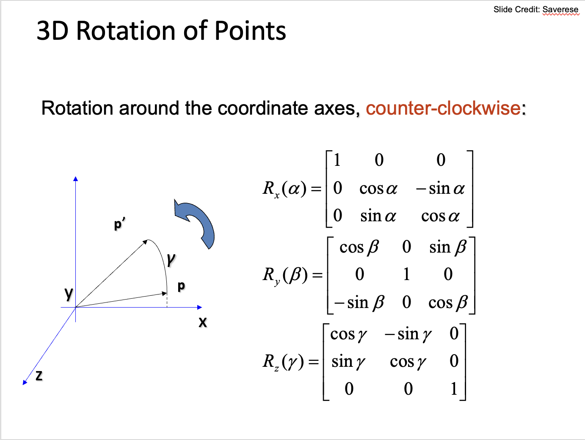

We use rotation matrices like in .

The idea is we have confetti starting at (rand(-10, 10), 10, 0)
with coordinates (x,y,z). Which look like:

```
         ^ y
         |
         |
         |
         |
         ------------> x
```

And z coming out of the page.

Our camera has no rotation, but is at z = -10.

# TODO

* use zbuffer for depth (based on closest vertex)
